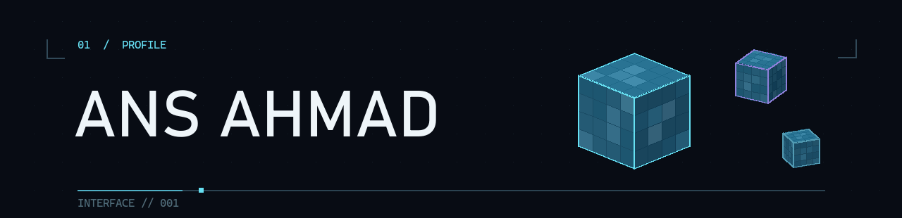

**Doctoral researcher · Human–technology interaction (games and gamification)** 
Tampere, Finland

I study how people learn, interpret information and make decisions with technology. My work connects research with games, extended reality and digital product design—especially where financial literacy and cognitive biases meet human experience.

### 01 / Loadout

`Unity` &nbsp; `C#` &nbsp; `JavaScript` &nbsp; `Three.js` &nbsp; `Python` &nbsp; `Figma`

### 02 / Connect

[LinkedIn](https://www.linkedin.com/in/ansahmad/) · [YouTube](https://www.youtube.com/@AnsAhmadibaonix) · [ORCID](https://orcid.org/0009-0005-2664-6007)

